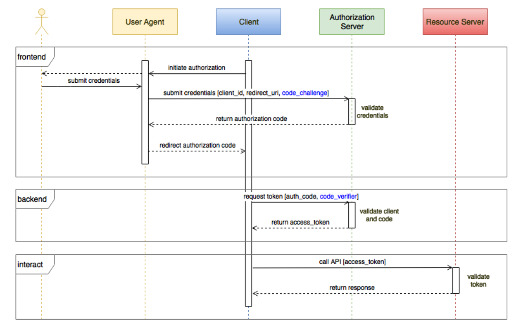
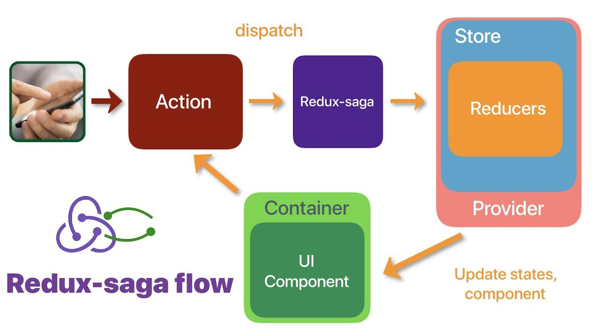

## React PKCE sample app

Complete impementation of login / logout functionality using solera globalpass / Solera Azure AD via PKCE

## How PKCE (RFC7636) flow works

The Proof Key for Code Exchange (PKCE, pronounced pixie) extension describes a technique for public clients to mitigate the threat of having the authorization code intercepted. The technique involves the client first creating a secret, and then using that secret again when exchanging the authorization code for an access token. This way if the code is intercepted, it will not be useful since the token request relies on the initial secret.

## Tech used

